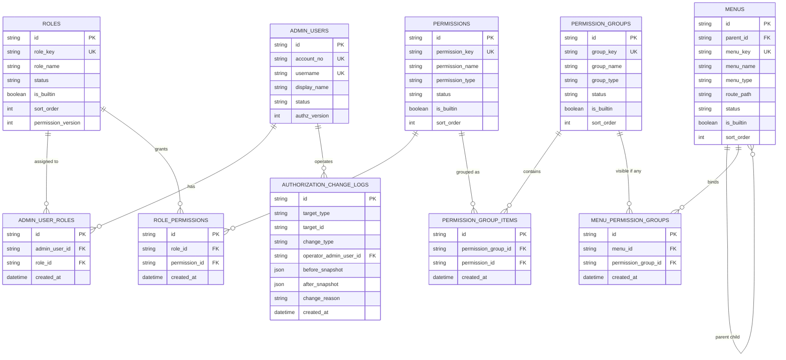

# 权限与菜单模型草案

## 文档目标

把“权限点落库、权限组配置、菜单绑定、角色授权、生效策略”收敛成可指导当前 Prisma 实现与后续扩展的模型文档。

## 先看结论

- `Permission` 只表达原子 `action`，不再把菜单可见性直接建成权限点
- `PermissionGroup` 是一组 action 的配置层，用于菜单、页面域、批量授权和阅读理解
- `RolePermission` 仍是最终授权真相源；角色 UI 勾组选项时，保存阶段把组内 action 展开写入 `RolePermission`
- `Menu` 与 `PermissionGroup` 通过关联表绑定，一个菜单可绑定多个权限组，语义为 `anyOf`
- `*` 继续保留为超级管理员全权标记，不落到权限组层做特殊继承
- 已登录后台用户的角色与权限变更，允许通过“版本号或缓存 TTL”在最长 `5` 分钟内生效

## 适用范围

- 后台 `admin-api` 的 RBAC
- 后台前端菜单可见性、页面 `403`、按钮隐藏
- 后台角色、权限点、权限组、菜单的系统管理能力

不适用：

- 会员侧资源归属鉴权
- 公开页匿名访问控制

## 目标表清单

当前 schema 已在现有 `admin_users / roles / permissions / admin_user_roles / role_permissions` 之上补齐：

- `permission_groups`
- `permission_group_items`
- `menus`
- `menu_permission_groups`
- `authorization_change_logs`

并扩展了现有表：

- `roles`
- `permissions`
- `admin_users`

## 当前落地状态

- Prisma 已落地 `permission_groups / permission_group_items / menus / menu_permission_groups / authorization_change_logs`
- 后台系统管理已提供“权限点 / 权限组 / 菜单权限 / 变更日志”页面
- 权限组成员保存、菜单权限组绑定保存均写入 `authorization_change_logs`
- 菜单运行时按 `PermissionGroup anyOf` 隐藏；直链无权限页面返回 `403`
- 孤儿 action 默认不自动出现在菜单体系中，系统页可单独筛查

## 数据表 ER 图

说明：

- 一个菜单可绑定多个权限组，命中任意一个权限组即可展示
- 一个 action 可归属多个权限组，但不允许权限组嵌套权限组
- `authorization_change_logs` 采用 `targetType + targetId` 表达多对象审计目标，属于弱外键设计
- 当前 Prisma 实现已覆盖本图中的表关系；后续若增加“权限组异常告警”实体，再单独扩展

## 表级设计草案

### `permissions`

建议保留现有主表，并补充以下字段：

| 字段 | 建议 | 说明 |
|---|---|---|
| `permission_key` | `unique` | 稳定主键，代码与数据库共享 |
| `permission_name` | 必填 | 后台展示名称 |
| `permission_type` | 保留枚举 | 迁移期允许 `PAGE / ACTION`，目标收敛为 `ACTION` |
| `status` | `ENABLED / DISABLED` | 停用后不再参与授予与菜单展开 |
| `is_builtin` | `boolean` | 区分内置与自定义权限 |
| `description` | 可空 | 对动作风险与用途做说明 |
| `sort_order` | 默认 `0` | UI 排序 |

建议约束：

- `permission_key='*'` 继续保留为超级管理员特权标记
- 内置权限不允许删除，不允许改 `permission_key`
- 孤儿 action 可以存在，但默认不进入授权 UI 主列表，也不自动挂到菜单

### `permission_groups`

建议新增权限组主表：

| 字段 | 建议 | 说明 |
|---|---|---|
| `group_key` | `unique` | 稳定组键，如 `members`、`system.roles` |
| `group_name` | 必填 | 展示名称 |
| `group_type` | 枚举 | 建议 `BUSINESS / SYSTEM / PAGE_DOMAIN` |
| `status` | `ENABLED / DISABLED` | 停用后菜单不应继续命中 |
| `is_builtin` | `boolean` | 区分内置与自定义权限组 |
| `description` | 可空 | 说明此组覆盖哪些 action |
| `sort_order` | 默认 `0` | UI 排序 |

建议约束：

- 权限组只允许单层结构，不加 `parentId`
- 内置权限组不允许删除，不允许改 `group_key`
- 一个权限组至少应有一个有效 action；空组允许暂存但应在后台告警

### `permission_group_items`

建议新增权限组与 action 的映射表：

| 字段 | 建议 | 说明 |
|---|---|---|
| `permission_group_id` | 外键 | 关联权限组 |
| `permission_id` | 外键 | 关联 action 权限 |
| `created_at` | 必填 | 建立映射时间 |

建议约束：

- `@@unique([permission_group_id, permission_id])`
- 不允许写入 `permission_key='*'`
- `permission.status=DISABLED` 时，不建议再被新增绑定

### `roles`

建议在现有角色表上补充：

| 字段 | 建议 | 说明 |
|---|---|---|
| `is_builtin` | `boolean` | 区分内置与自定义角色 |
| `description` | 可空 | 角色职责说明 |
| `sort_order` | 默认 `0` | UI 排序 |
| `permission_version` | 默认 `1` | 角色权限集版本号 |

建议约束：

- 内置角色不允许删除，不允许改 `role_key`
- 内置角色允许改显示名、描述、排序、启停状态
- 角色权限保存时直接刷新 `role_permissions`，并递增 `permission_version`

### `role_permissions`

继续作为最终授权真相源：

- 角色在 UI 上勾选权限组时，保存阶段先把权限组展开为 action 集
- 去重后批量写入 `role_permissions`
- `Guard / Controller / Service` 只按 action 级 `permission_key` 鉴权

这意味着：

- 不新增 `role_permission_groups`
- 不在运行时直接按组放行接口

### `menus`

建议新增菜单配置主表：

| 字段 | 建议 | 说明 |
|---|---|---|
| `parent_id` | 自关联外键，可空 | 支持目录与页面层级 |
| `menu_key` | `unique` | 稳定菜单键 |
| `menu_name` | 必填 | 展示名称 |
| `menu_type` | 枚举 | 建议 `DIRECTORY / PAGE / EXTERNAL_LINK` |
| `route_path` | 可空 | 前端路由 |
| `icon_name` | 可空 | 前端图标标识 |
| `status` | `ENABLED / DISABLED` | 菜单启停 |
| `is_builtin` | `boolean` | 区分内置与自定义菜单 |
| `sort_order` | 默认 `0` | 菜单排序 |

建议约束：

- 内置菜单不允许删除，不允许改 `menu_key`
- 页面菜单建议一条记录对应一个稳定路由
- 按钮权限不建到 `menus` 表，按钮仍直接消费 action

### `menu_permission_groups`

建议新增菜单与权限组绑定表：

| 字段 | 建议 | 说明 |
|---|---|---|
| `menu_id` | 外键 | 关联菜单 |
| `permission_group_id` | 外键 | 关联权限组 |
| `created_at` | 必填 | 建立绑定时间 |

建议约束：

- `@@unique([menu_id, permission_group_id])`
- 语义固定为 `anyOf`
- 不提供 `allOf` 模式，避免前端、后端、配置理解分裂

### `authorization_change_logs`

建议新增统一审计表，覆盖以下变更：

- 角色授予 / 撤销 action
- 角色绑定后台用户
- 权限组成员变更
- 菜单与权限组绑定变更
- 权限、权限组、菜单、角色的启停

建议字段：

| 字段 | 建议 | 说明 |
|---|---|---|
| `target_type` | 枚举或字符串 | 例如 `ROLE`、`PERMISSION_GROUP`、`MENU` |
| `target_id` | 字符串 | 目标对象主键 |
| `change_type` | 枚举或字符串 | 例如 `UPSERT`、`ENABLE`、`DISABLE`、`REPLACE_BINDINGS` |
| `operator_admin_user_id` | 外键 | 操作人 |
| `before_snapshot` | JSON | 变更前快照 |
| `after_snapshot` | JSON | 变更后快照 |
| `change_reason` | 可空 | 操作说明 |
| `created_at` | 必填 | 发生时间 |

## 运行时判定口径

### 接口鉴权

- 只认 action 级 `permission_key`
- `*` 直接放行
- 不因命中某个权限组而直接放行接口

### 菜单展示

- 先查菜单绑定的权限组
- 再根据当前用户 action 集反推命中的权限组
- 命中任意一个权限组则显示菜单

### 页面进入

- 菜单隐藏不等于页面可访问
- 直链进入页面时仍需路由守卫或接口返回 `403`

### 页面内按钮

- 按钮直接消费 action
- 无权限时隐藏，不走“展示但禁用”的默认策略

## 生效策略

产品口径已经明确：

- 新登录用户：保存后立即生效
- 已登录用户：最长 `5` 分钟内生效

建议二选一：

1. 短 TTL 后台 access token
2. `permission_version + authz_version` 与服务端缓存联合校验

更稳妥的实现建议：

- `roles.permission_version`：角色权限集变化时递增
- `admin_users.authz_version`：后台用户角色绑定变化、账号禁用时递增
- 登录签发 token 时带入 `authzVersion`
- 服务端按 `adminUserId` 缓存展开后的 `permissionKeys`，TTL 设为 `5` 分钟
- 角色或用户权限变更时主动清理对应缓存；漏清时由 TTL 兜底

这样可以满足：

- 新登录立即拿到新权限
- 老登录最慢 `5` 分钟内收敛

## 与现状的兼容迁移

### 第一步：补主数据表

- 新增 `permission_groups / permission_group_items / menus / menu_permission_groups / authorization_change_logs`
- 扩展 `roles / permissions`

### 第二步：迁移旧权限 key

- 保留现有 `dashboard.read`、`members.read` 等已稳定 key
- 将 `nav.m2_placeholder` 标记为过渡兼容项，不再给新菜单使用
- 新增或改造业务域权限时，优先直接落到稳定的细粒度 action，不再默认引入新的 `*.manage` 过渡 key

建议优先拆解：

- `issuance.series` -> `issuance.series.create`、`issuance.series.update`、`issuance.series.toggle_status`
- `issuance.batches` -> `issuance.batches.create`、`issuance.batches.update`、`issuance.batches.toggle_status`
- `issuance.activation_codes` -> `issuance.activation_codes.generate`、`issuance.activation_codes.void`
- `collections` -> `collections.read`、`collections.toggle_status`（当前已落地）
- `members` -> `members.read`、`members.freeze`、`members.unfreeze`（当前已落地）
- `collection_reviews` -> `collection_reviews.read`、`collection_reviews.approve`、`collection_reviews.reject`、`collection_reviews.takedown`（当前已落地）
- `notifications` -> `notifications.read`、`notifications.template.create`、`notifications.template.update`、`notifications.template.toggle_status`、`notifications.dispatch.retry`
- `transfers` -> `transfers.read`、`transfers.complete`、`transfers.rollback`、`transfers.expire`、`transfers.sync_owner`
- `collection_comments` -> `collection_comments.read`、`collection_comments.approve`、`collection_comments.reject`、`collection_comments.block`（当前已落地）

### 第三步：迁移菜单配置

- 把 `apps/admin/src/components/layout/data/sidebar-data.ts` 中的硬编码菜单逐步迁到 `menus`
- 原 `anyOfPermissions` 过渡为 `MenuPermissionGroup`
- 前端菜单渲染逐步从“硬编码路由配置 + permission key”切到“菜单 API + 本地路由映射”

### 第四步：补系统管理 CRUD

- 后端补 `admin_users / roles / permissions / permission_groups / menus` 的 `admin-api`
- 前端把“后台用户”“角色权限”从静态壳子切成真实 CRUD

## 推荐种子数据分层

建议把内置主数据拆成四份种子：

- 内置 action 权限
- 内置权限组
- 内置菜单
- 内置角色

并遵循：

- 内置角色只绑定 action，不直接绑定权限组
- 内置菜单只绑定权限组，不直接绑定 action
- 权限组负责把“页面域”翻译成一组 action

## 配置校验与告警

以下场景需要在后台配置保存时校验，并在运行时保守处理：

- 权限组为空：允许保存但告警
- action 未归属任何权限组：不自动展示，只在异常列表提示
- 菜单未绑定任何权限组：默认隐藏并告警
- 菜单绑定到已停用权限组：默认隐藏并告警
- 历史脏数据导致绑定目标不存在：默认隐藏并告警

## 推荐的首批权限组

- `dashboard`
- `issuance.series`
- `issuance.batches`
- `issuance.activation_codes`
- `collections`
- `collection_reviews`
- `collection_comments`
- `members`
- `notifications`
- `transfers`
- `system.admin_users`
- `system.roles`
- `system.menus`

## 推荐的首批系统管理 action

- `admin_users.read`
- `admin_users.create`
- `admin_users.update`
- `admin_users.enable`
- `admin_users.disable`
- `admin_users.assign_roles`
- `roles.read`
- `roles.create`
- `roles.update`
- `roles.enable`
- `roles.disable`
- `roles.assign_permissions`
- `permissions.read`
- `permissions.create`
- `permissions.update`
- `permissions.enable`
- `permissions.disable`
- `permission_groups.read`
- `permission_groups.create`
- `permission_groups.update`
- `permission_groups.enable`
- `permission_groups.disable`
- `menus.read`
- `menus.create`
- `menus.update`
- `menus.enable`
- `menus.disable`

## 下一步实现建议

如果下一步进入实现，建议按这个顺序：

1. 先改 Prisma schema 与 seed，补主数据表和约束
2. 再补后台系统管理查询接口，先做只读列表和详情
3. 然后补角色授权保存、菜单读取与权限组绑定
4. 最后替换前端侧边栏和系统管理页面
